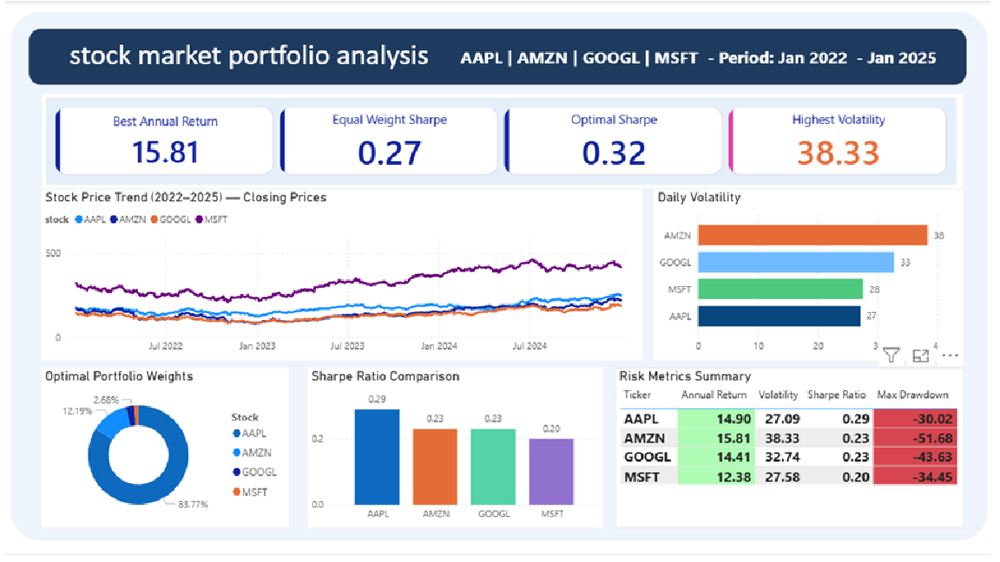

**Stock Market Portfolio Analysis**

This project analyzes AAPL, AMZN, GOOGL, MSFT stocks from Jan 2022 to Jan 2025.

**TOOLS USED**
Python (yfinance, pandas, numpy, matplotlib, seaborn)
Power BI

**WHAT THIS PROJECT DOES**
- Downloads 3 years of real stock price data
- Calculates daily returns, annual returns and volatility
- Computes Sharpe ratio for risk-adjusted returns
- Finds best portfolio using Monte Carlo simulation (5000 portfolios)
- Builds interactive dashboard in Power BI

**KEY RESULTS**
Best Annual Return     : AMZN at 15.81%
Highest Volatility     : AMZN at 38.33%
Safest Stock           : AAPL at 27.09%
Optimal Sharpe Ratio   : 0.315
Optimal Weights        : AAPL 83.8%, AMZN 12.2%, GOOGL 2.7%, MSFT 1.4%

**DASHBOARD PREVIEW**

**FILES IN THIS PROJECT**
stockanalysis.ipynb   - Python analysis code
stock_prices.csv      - Daily closing prices
stock_returns.csv     - Daily returns
risk_summary.csv      - Risk metrics per stock
optimal_weights.csv   - Best portfolio weights
stock_analysis.pbix   - Power BI dashboard

**HOW TO RUN**
1. pip install yfinance pandas numpy matplotlib seaborn
2. Open stockanalysis.ipynb and run all cells
3. Open stock_analysis.pbix in Power BI Desktop

**ABOUT**
End-to-end data analysis project from Python to Power BI.
Built by Sree Varsha as a portfolio project.

 **Project Overview**
This project analyzes stock portfolio performance to evaluate returns, risk, and investment efficiency.

---

**Key Insights**
- Identified top-performing stocks based on return percentage  
- Compared portfolio diversification and risk exposure  
- Analyzed trends to support better investment decisions  

---

**Business Impact**
Helps investors understand portfolio performance and make data-driven investment decisions.
